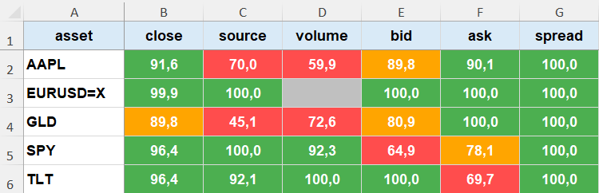

# Risk Monitoring & Data Quality Engine

## Completeness Overview

This project presents a data quality monitoring framework built on multi-asset market data, with a practical focus on risk / market data monitoring rather than pure modelling.

The main idea behind the project is straightforward: before computing any risk metric (VaR, stress testing, etc.), the first step should always be to assess whether the input data is reliable enough.

In many cases, issues in risk outputs are not driven by the model itself, but by poor data quality. This project focuses on building a small but structured control layer to identify those issues early.

---

The workflow follows a simple and logical sequence.

It starts from data preparation, where raw market data is enriched with additional fields such as bid, ask, spread and source. This step helps create a slightly more realistic dataset compared to a basic price-only setup.

The next step focuses on completeness checks, measuring data availability across assets and fields and highlighting missing observations.

After that, a validation and outlier detection layer is applied. Basic rules are used to identify inconsistencies in the data, while abnormal price movements are detected using log returns.

Finally, all identified issues are consolidated into a single asset-level summary table, providing a compact view of where potential data problems are concentrated.

---

The checks implemented in this framework are intentionally simple, but designed to be realistic and interpretable in a risk monitoring context.

They include:
- completeness monitoring  
- validation rules on key fields  
- outlier detection  
- consolidated data quality issues summary  

The goal is not to cover every possible data issue, but to build a clear and usable structure that could realistically support a monitoring process.

---

The final output is designed to be easy to read and interpret, including:
- a completeness heatmap  
- a data quality issues summary table  

This type of output is closer to what would be expected in a reporting or monitoring environment, rather than a purely analytical notebook.

---

This project focuses on the control logic and monitoring structure rather than on distributing full production datasets. Sample data is used to illustrate typical data quality issues and how they can be identified.

As a next step, this data quality layer can be integrated into a broader risk framework, combining market risk metrics, stress testing and scenario analysis.

The idea is to move from isolated analytics to a more complete and structured risk monitoring setup.